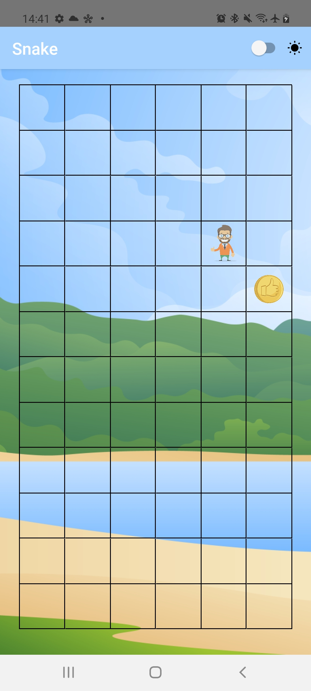

# 🚀 React Snake Redux Bellman Ford - Jan 2021

 

## How this looks
  
  
## Prerequisites

- [Node](https://nodejs.org) v12 (it is recommended to install it via [NVM](https://github.com/creationix/nvm))
- [Yarn](https://yarnpkg.com/)
- A development machine set up for React Native by following [these instructions](https://facebook.github.io/react-native/docs/getting-started.html)

## Getting Started

1. Clone this repo, `git clone https://github.com/dguard/react-snake-redux-bellman-ford.git`
2. Go to project's root directory, `cd react-snake-redux-bellman-ford`
3. Run `yarn` to install dependencies

4. Start the packager with `yarn start`
5. Connect a mobile device to your development machine
6. Run the test application:

- On Android:
  - Run `react-native run-android` or Use Android Studio (Recommended)
- On iOS:
  - Open `ios/YourReactProject.xcworkspace` in Xcode
  - Hit `Run` after selecting the desired device

7. Enjoy!!!

## Stay in touch

- Contributor: [Alexander Serditov](https://cv.digitallyconstructed.ru/)
- Uses parts from contributor: [Victor K Varghese](https://github.com/victorkvarghese/react-native-boilerplate)

## License

  [MIT licensed](LICENSE).

## Contributing

PRs are welcome
